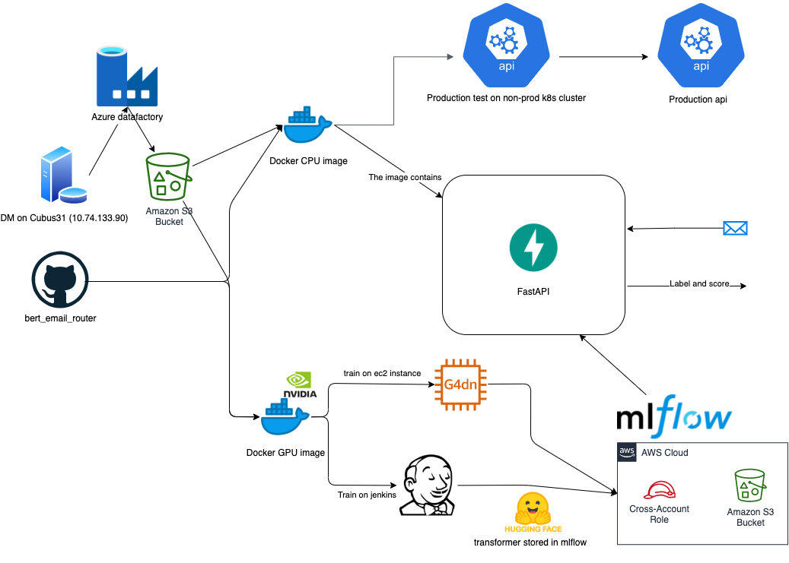

## BERT Sequence prediction for email routing

[](http://unmaintained.tech/)
[](https://github.com/sindresorhus/awesome)
[](https://github.com/nuuday/bert_email_router)

With this project we XXX
Here we train, predict and serve the Danish ConvBert model ([https://huggingface.co/sarnikowski](https://huggingface.co/sarnikowski)) trained for classification of emails to labels relevant for moving the tasks. 

We will be serving the model in FastAPI, with a swagger here: [https://emailrouter.martech.prod.managed-eks.aws.nuuday.nu/docs](https://emailrouter.martech.prod.managed-eks.aws.nuuday.nu/docs)

We will also host a attribution checker dashboard based on dash and captum, to give insights into how the model makes predictions, and also to keep score on performance evaluation in production. This dashboard is not yet live, but the link will be available here in the future.


#### Dataflow



## Getting Started

### Prerequisites

Dependencies are installed with poetry, which is installed using

``` bash
curl -sSL https://raw.githubusercontent.com/python-poetry/poetry/master/get-poetry.py | python -
```

Most likely you would also like your virtual environment to reside in the project folder, do once as
``` bash
poetry config virtualenvs.in-project true
```

Secrets as given in the [settings.py](https://github.com/nuuday/bert_email_router/src/settings.py)

A not necessary step for most is to install pyenv to get a compatible python version
``` bash
curl -sSL https://github.com/pyenv/pyenv-installer/raw/master/bin/pyenv-installer | bash
```

### Installing

Link to your version of python using 
``` bash
poetry env use <python-version>
```

A python version could be installed using
``` bash
pyenv install 3.8.8
```
Currently there are some issues on some platforms with using pyenv to install python. If you experience problems with sqlite3 on amazon linux (redhat distribution) try 
``` bash
yum list | grep sqlite
sudo yum install sqlite-devel.x86_64
pyenv install 3.8.8
```

And you can install the dependencies using 
``` bash
poetry install (or update)
```

Add spacy nlp package for danish like
``` bash
python -m spacy download da_core_news_sm
```
(spacy is actually not really used yet)

## Running the tests

``` bash
poetry run pytest | tee output.log
```

### And coding style tests

``` bash
poetry run black src
```

## Deployment

Training requires an Nvidia GPU, Nvidia driver and docker environment as specified in [https://github.com/NVIDIA/nvidia-docker](https://github.com/NVIDIA/nvidia-docker), since we utilize gpu in runtime of the training. Training is exercised using 

```
docker login https://docker.pkg.github.com/nuuday/ -u nuuday -p ${GITHUB_TOKEN}"
```

``` 
docker run -t --gpus all \
    -e AWS_ACCESS_KEY_ID -e AWS_SECRET_ACCESS_KEY \
    -e MARIADB_USR -e MARIA_DB_PASSWORD \
    -e MLFLOW_TRACKING_USERNAME -e MLFLOW_TRACKING_PASSWORD \
    docker.pkg.github.com/nuuday/bert_email_router/bert_email_router:latest-gpu \
    'python3 train.py'"
```

For training **train.py** is the main point of entry. If we want to perform hyperparameter optimization, we add the space here, with a default given by:

``` python
hp_space = model_utils.default_hp_space_optuna()
```
Through this space we add it to the train function, which, if this space is not added, will not perform hyperparameter optimization. The number of trials is given by an environment-variable as specified in the settings-file as *N_TRIALS*.

If we just want to train the model under certain parameters, we use this parameter class

``` python
params = bert.BertParams(unique_tags=unique_tags, tag2id=tag2id, id2tag=id2tag, epochs=3)
```
Which also holds other features for us, and speaks to the huggingface trainerargument class among others. The default values of this class should in the optimal case reflect the best parameters given by the hyperparameter optimizations. Again, this could be seen through [mlflow.nuuday-ai.cloud](mlflow.nuuday-ai.cloud)

For remember to change the experiment name in train.py for easier access to relevant training sessions in mlflow.

We host the api on kubernetes with a testing environment at [emailrouter.martech.non-prod.managed-eks.aws.nuuday.nu/docs](emailrouter.martech.non-prod.managed-eks.aws.nuuday.nu/docs). If the test looks alright, it will be accepted by the maintainers and go on to production at [emailrouter.martech.prod.managed-eks.aws.nuuday.nu/docs](emailrouter.martech.prod.managed-eks.aws.nuuday.nu/docs).

The model versioning and predict function class is managed through mlflow as well, and probably a staging environment for tests on these new function classes should be setup as tests later on as well.

The deployment pipeline in the github actions both features gpu images for training and cpu images for inference.

## Contributing

Please read [CONTRIBUTING.md](CONTRIBUTING.md) for details on our code of conduct, and the process for submitting pull requests to us.

## Versioning

We use [SemVer](http://semver.org/) for versioning. For the versions available, see the [tags on this repository](https://github.com/nuuday/project/tags). 

## Authors

* **Martin Højland** - *Initial work* - [hojland](https://github.com/Hojland)

See also the list of [contributors](https://github.com/project/contributors) who participated in this project.


## Acknowledgments